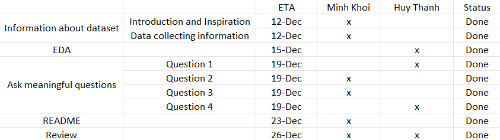

# PROGRAMMING FOR DATA SCIENCE - HCMUS

## Final Project - Stroke Prediction

### I. Team Profile

Class: 21KHDL1

| Student's ID | Full Name        |
| ------------ | ---------------- |
| 21127081     | Nguyễn Minh Khôi |
| 21127430     | Nguyễn Huy Thành |

### II. Introduction

- Strokes are an important preventable cause of death and disability on over the world. Nearly 800,000 people in the United States suffer from a stroke each year, with about three in four being first-time strokes. Especially, Vietnam experiences around 200,000 cases of stroke annually, and similar to other chronic diseases, this number is on an upward trend.
- In this project, we focus on researching the relationships between strokes and factors such as genders, age, as well as medical history, including high blood pressure, smoking, and others.

#### **_01. Dataset:_**

- [Stroke Prediction Datasets](https://www.kaggle.com/datasets/fedesoriano/stroke-prediction-dataset)

#### **_02. Meaningful questions and questions analysis:_**

- **Question 1:** Based on this dataset, How can we learn the general knowledge of stroke?
- **Question 2:** Which among age, average glucose level, and body mass index (BMI) shows the most significant connection to the probability of stroke?
- **Question 3:** What is the impact of health-related factors on the proportion of strokes?
- **Question 4:** How can we predict the probability of a person based on their personality and comorbidities?

### III. Team Planning

